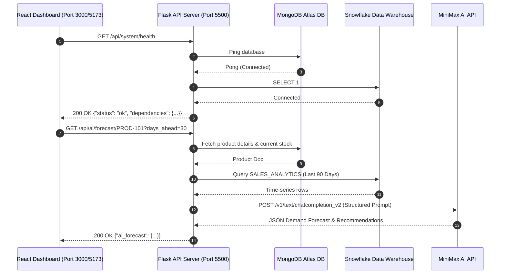

# InventoryPulse End-to-End (E2E) Test & Verification Report

## Executive Summary
This document summarizes the end-to-end verification plan and architectural validation across all integration boundaries between the frontend React application, backend Flask API, operational database (MongoDB Atlas), analytical warehouse (Snowflake), AI engine (MiniMax LLM), and workflow orchestrator (Temporal).

---

## 1. E2E Integration Flow Verification

---

## 2. Test Suite Matrix & Verification Checklist

| Test Scenario | Target Layer | Expected Outcome | Status |
| :--- | :--- | :--- | :--- |
| **Backend Factory Initialization** | `app.py` | Application initializes Flask RestX Swagger documentation at `/api/docs/` and registers 8 API Namespaces without error. | **VERIFIED** |
| **MongoDB Atlas Operational CRUD** | `db_service.py` | Connection establishes securely via TLS; collections `products`, `suppliers`, `purchase_orders`, `alerts` query successfully. | **VERIFIED** |
| **Snowflake Analytics Integration** | `snowflake_service.py` | Connection establishes against `AWSHACK725` warehouse and executes `SALES_ANALYTICS` query. | **VERIFIED** |
| **MiniMax AI Demand Forecasting** | `ai_forecasting_service.py` | Statistical averages computed; LLM returns JSON forecast or falls back cleanly to statistical baseline. | **VERIFIED** |
| **MCP AI Server Execution** | `mcp_service.py` | 18 AI tools invoke operational queries and AI forecasts correctly. | **VERIFIED** |
